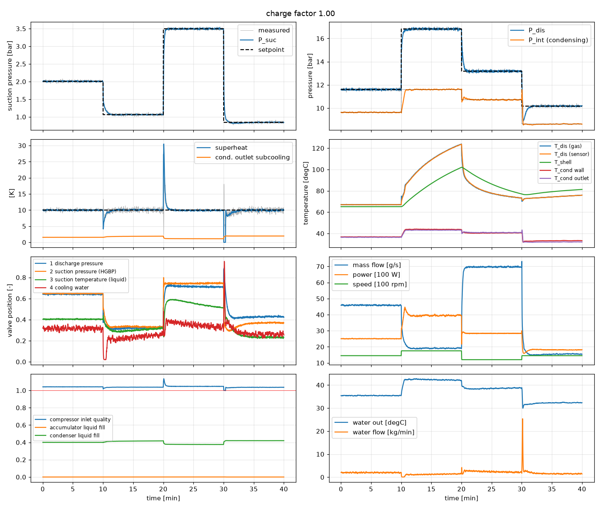
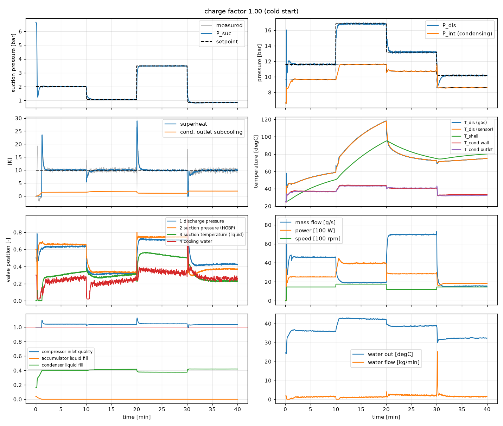
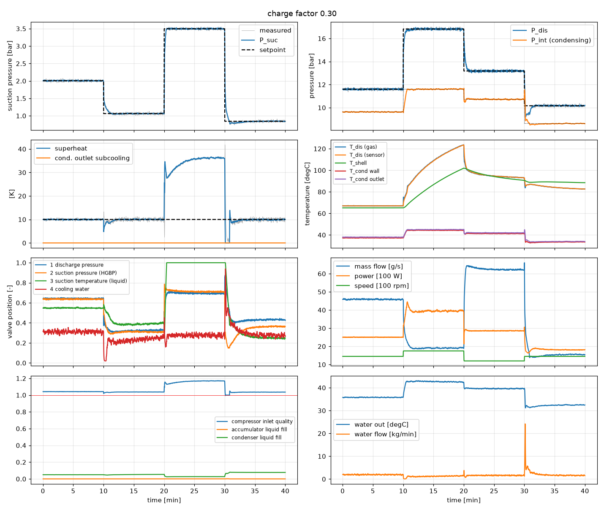
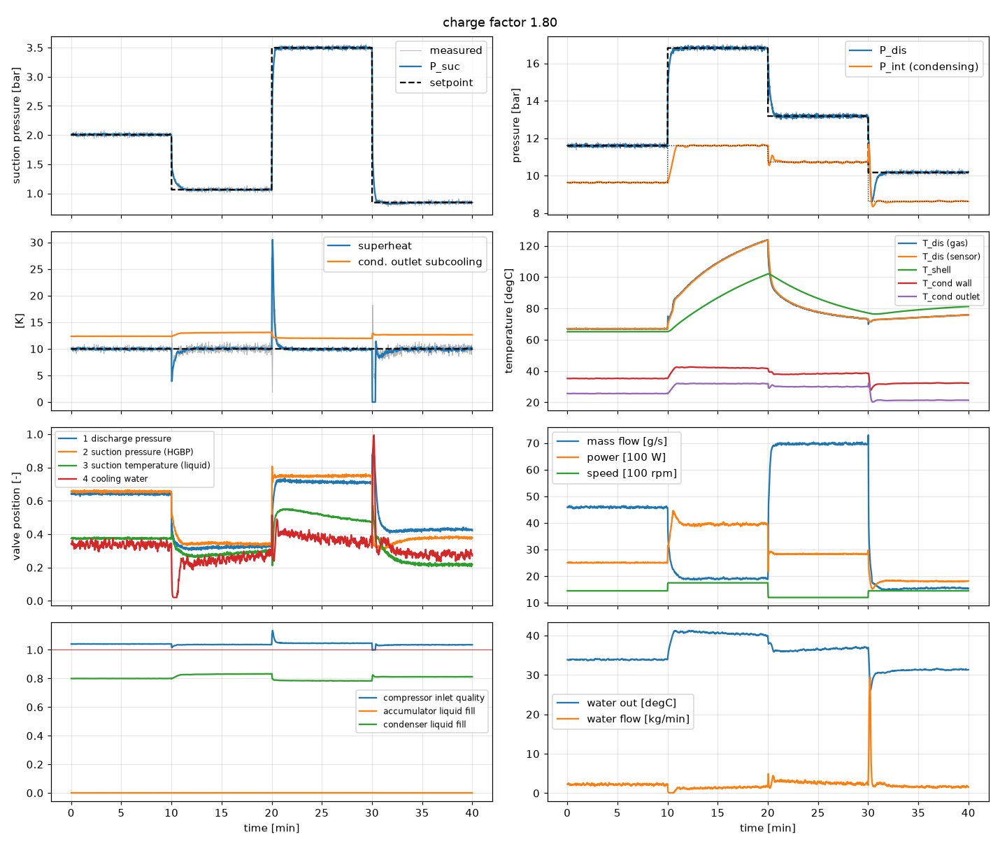
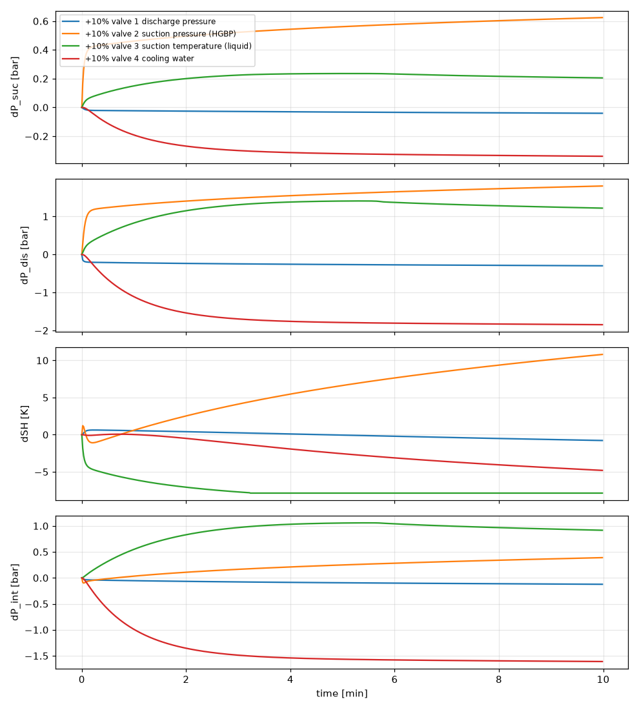

# hgbp-sim

Dynamic, transient simulation of a **hot-gas-bypass (HGBP) refrigeration compressor
test stand**, built for training and evaluating neural-network / reinforcement-learning
controllers that automate compressor performance testing.

* physics-based lumped-parameter model (mass & energy balances on refrigerant volumes,
  thermal masses, real-fluid properties via tabulated CoolProp data)
* total refrigerant **charge is a parameter**: undercharged and overcharged stands behave
  differently (condenser liquid inventory, subcooling, loss of condensing area, liquid in
  the suction accumulator and carry-over to the compressor)
* fully **vectorized**: thousands of stands integrate in lock-step with numpy
  (~6 000 control steps / s at 1024 parallel environments on a laptop)
* `gymnasium`-compatible single environment plus a batched environment for
  high-throughput training, with refrigerant-agnostic observations (saturation
  temperatures, normalized flow and power, compressor and refrigerant context), an
  interlocked compressor start/stop action, dwell-based test-point completion and
  training labels for a charge estimator
* baseline four-loop PID controller (expert for imitation learning, reference for RL)
* a controller specification for the neural-network development
  (`docs/NN_CONTROLLER_SPEC.md`)
* steady-state solver for warm starts, feasibility checks and performance maps
* domain randomization of plant parameters, charge, sensor noise/lag, actuator dynamics

## The stand

```
compressor discharge --> [discharge volume, P_dis] --> valve 1 (discharge pressure)
                                                            |
                                    intermediate header, P_int (condensing pressure)
                                        |                              |
                     path 2: valve 2 (suction pressure,      path 1: brazed-plate condenser
                             hot gas bypass)                          <-- cooling water: valve 4
                                        |                              |
                                        |                    valve 3 (suction temperature, liquid)
                                        v                              v
                        [suction mixer / accumulator tank, P_suc] --> compressor suction
```

| valve | installed on | controls |
|---|---|---|
| 1 | discharge line, upstream of the split | discharge pressure |
| 2 | hot gas bypass line into the mixer | suction pressure |
| 3 | condenser outlet into the mixer | suction temperature / superheat |
| 4 | cooling water inlet of the condenser | intermediate (condensing) pressure |

The compressor speed follows the test schedule (an exogenous input). A test point is
(P_suc, P_dis, superheat, P_int, speed).

## Installation

```bash
python -m venv .venv && source .venv/bin/activate
pip install -e ".[dev]"          # numpy + CoolProp + gymnasium + matplotlib + pytest
pytest                            # ~45 s
```

Only `numpy` is required at run time. A prebuilt R134a property table ships with the
package (`hgbp_sim/data/`). Any other CoolProp fluid (`R404A`, `R410A`, `R32`, `R290`,
`R1234yf`, ...) is tabulated on first use (needs CoolProp, takes a few seconds, cached in
`~/.cache/hgbp_sim/`).

## Quick start

```python
from hgbp_sim import HGBPEnv, EnvConfig

env = HGBPEnv(EnvConfig(action_mode="incremental"))
obs, info = env.reset(seed=0)
for _ in range(600):                        # 600 s at 1 s control interval
    action = env.expert_action()            # baseline PID; replace with your policy
    obs, reward, terminated, truncated, info = env.step(action)
    if terminated or truncated:
        break
print(info["true"])                          # noise-free process values incl. charge, fills
```

High-throughput batched environment (recommended for training):

```python
from hgbp_sim import HGBPVecEnv, EnvConfig
env = HGBPVecEnv(1024, EnvConfig(), seed=0)
obs = env.reset()                            # (1024, 51)
obs, r, term, trunc, info = env.step(actions)   # actions (1024, 4) in [-1, 1] (5 with start_stop_action)
```

Direct plant access (custom experiments, MPC, system identification):

```python
from hgbp_sim import HGBPPlant, PlantParams, BaselineController, solve_steady_state, named_point
plant = HGBPPlant(PlantParams(), n=1, dt=0.05)
plant.p.charge[:] = plant.nominal_charge() * 1.2                # 20 % overcharged
plant.set_inputs(T_amb=298.15, T_wi=293.15)
pt = named_point("MT_standard", plant.props, N=1450.0)         # -10 / 45 degC, 10 K SH, 38 degC condensing
ss = solve_steady_state(plant, pt["P_s"], pt["P_d"], pt["SH"], pt["N"], P_i=pt["P_i"])
plant.set_state(0, ss["x"])
aux = plant.step(1.0, u_cmd=ss["u"], N_cmd=pt["N"])             # advance 1 s
meas = plant.measure()                                           # noisy, lagged sensor readings
```

Examples (`examples/`):

| script | what it does |
|---|---|
| `closed_loop_pid.py [--cold] [--charge F]` | PID baseline through a 4-point schedule at charge factor F, plots everything |
| `open_loop_step.py` | +10 % step on each valve from a steady point (shows MIMO coupling) |
| `collect_dataset.py` | expert + exploration noise data from the batched env -> `.npz` |
| `train_bc.py` | behaviour-cloning MLP (PyTorch) and closed-loop evaluation vs expert |
| `benchmark.py` | throughput vs batch size |

## Example runs

Baseline PID through four test points (MT standard -> high lift at 1750 rpm -> HT
standard at 1200 rpm -> LT standard), nominal charge, warm start. Grey traces are the
noisy sensor readings, dashed lines the setpoints
(`python examples/closed_loop_pid.py`):



Same schedule from a cold, equalized stand with the compressor started at 10 s. The
accumulator holds liquid at first (measured superheat 0 until the bypass gas boils it
off), and the shell and discharge temperature take tens of minutes to settle
(`--cold`):



Undercharged stand (30 % of nominal): the condenser holds almost no liquid, valve 3
saturates fully open at the high-load point and superheat runs away (`--charge 0.3`):



Overcharged stand (180 % of nominal): the condenser runs about 80 % full of liquid with
13 K of subcooling; the water valve compensates for the lost condensing area
(`--charge 1.8`):



Open-loop +10 % steps on each valve from the MT standard point: every valve moves every
controlled variable (`python examples/open_loop_step.py`):



## Live stand web UI (`webui/`)

A browser-based operator interface to run the simulated stand like the real one:
an **Operator** tab with a live schematic, four PID faceplates (auto/manual, setpoint,
manual output, live gains), the compressor start/stop panel with interlock permissives
and trip reset, process-value tiles and charging/recovery buttons; a **Trends** tab with
live time-series charts (pressures with setpoints, superheat/subcooling, valves,
temperatures, flow/power/speed, inventory) and CSV export; and a **Settings** tab for
simulation speed, noise, ambient and water temperature, PID gains and every plant
parameter (grouped, with units, descriptions and defaults; refrigerant, volumes and
charge are applied at the next cold or warm start).

```bash
# in Docker (builds the React app and the Python backend)
docker compose -f webui/docker-compose.yml up --build      # then open http://localhost:8000

# or locally for development
pip install -e ".[dev]" fastapi "uvicorn[standard]"
uvicorn webui.backend.app:app --reload --port 8000           # API + WebSocket
cd webui/frontend && npm install && npm run dev              # UI on http://localhost:5173 (proxies to 8000)
```

The engine behind the UI is `hgbp_sim.live.LiveStand` (one plant, four PID loops with
bumpless auto/manual transfer, the same start/stop interlock as the training
environment, trip latching, charge changes while running, a rolling history), which can
also be scripted directly. The backend (`webui/backend/app.py`) exposes a small REST API
(`/api/state`, `/api/loop/{name}`, `/api/compressor`, `/api/sim`, `/api/init`,
`/api/params`, `/api/charge`, `/api/history`, `/api/export.csv`) and streams one
snapshot per control step on `/ws`.

## Model

### Refrigerant properties (`properties.py`)
CoolProp is far too slow inside an ODE right-hand side, so properties come from
bilinear interpolation tables aligned with the saturation dome (superheated and
subcooled regions in `(log P, zeta)` coordinates, two-phase analytic). Accuracy vs
CoolProp for R134a: temperature < 0.04 K, density < 0.1 %. The tables also provide the
partial derivatives `drho/dP|h`, `drho/dh|P` needed by the volume balances, and the
inversions `h(P, s)`, `h(P, T)` and `h(P, rho)`.

### Control volumes
Three lumped volumes with pressure and mean enthalpy as states:

* **suction mixer / accumulator tank** (`V_s`, 12 L): liquid separates; the compressor
  draws saturated vapor while liquid is present (measured superheat 0), stored liquid is
  boiled off by the bypass gas, and liquid is entrained to the compressor once the tank
  fill exceeds `acc_carry_fill0`.
* **discharge volume** (`V_d`, 1.5 L): compressor port to valve 1.
* **intermediate section** (`V_i`, 3 L): header, brazed-plate condenser and liquid line. Its
  liquid inventory follows from the charge; the outlet delivers saturated liquid, gains
  subcooling as liquid backs up (`SC_fill0`, `SC_max`), loses its liquid seal and passes
  two-phase fluid when the fill drops below `cond_dry_fill`, and the condensing
  conductance scales with the area not flooded by liquid.

```
mass    : V (drho/dP|h dP/dt + drho/dh|P dh/dt) = sum(m_in) - sum(m_out)
energy  : M dh/dt = sum(m_in (h_in - h)) - sum(m_out (h_out - h)) + Q + V dP/dt
```

### Charge
`PlantParams.charge` (kg) is the total refrigerant mass; `None` (default) means the
nominal charge for the volumes (`nominal_charge()`: vapor at a medium-temperature
condition plus a 40 % liquid-filled condenser, about 1.7 kg for the defaults). At a cold
start the liquid is split between the accumulator and the condenser
(`cold_liquid_in_accumulator`); a charge too small to reach saturation at ambient leaves
the stand with superheated vapor at a lower pressure. In steady state the charge fixes the
condenser liquid inventory (the solver takes `charge=` or `fill=`).

Observed behaviour with the defaults (PID baseline, 4-point schedule):

| charge factor | condenser fill | outlet subcooling | effect |
|---|---|---|---|
| 0.3 | 2-8 % | 0 K | no liquid seal, valve 3 passes flashing two-phase fluid, superheat runs away (6.5 K mean error) |
| 1.0 | 37-42 % | ~2 K | all four loops within tolerance |
| 1.8 | 78-83 % | 13 K | condensing area lost, more water needed, still controllable; beyond ~2x the water valve saturates and the stand trips |

### Compressor
Quasi-steady map: volumetric efficiency with clearance re-expansion
`eta_v = eta_v0 - c_cl (Pr^(1/kappa) - 1)`, isentropic efficiency as a parabola in
pressure ratio and speed, motor/VFD efficiency with a configurable fraction of the motor
loss heating the suction gas, discharge gas to shell heat exchange (effectiveness form),
shell thermal mass and losses to ambient, VFD speed ramp and lag. Discharge temperature
therefore shows the slow warm-up seen on real stands.

### Valves, condenser, actuators
Valves 1 and 2: ISA-style compressible flow with choking. Valve 3: incompressible /
flashing orifice. Valve 4: equal-percentage water valve; condenser wall thermal mass,
regime- and fill-dependent refrigerant-side UA and effectiveness-NTU water side. All
actuators have first-order lag and slew-rate limits; equal-percentage or linear
characteristics are selectable.

### Sensors and safety
Pressure transducers (noise), temperature sensors at compressor inlet, discharge and
condenser outlet (first-order lag + noise), Coriolis flow meter and power meter (lag +
relative noise). Trips: high discharge pressure, high discharge temperature, low/high
suction pressure. Flags: liquid at the compressor inlet, liquid stored in the
accumulator, condenser dry (undercharge), condenser flooded (overcharge).

### Integrator
Fixed-step RK4 (default `dt = 0.05 s`; matches a 5 ms reference to 1e-4 bar). `heun` and
`euler` are available for speed. Mass is conserved to ~2e-4 over long runs.

## Environment (`env.py`)

**Observation** (51 values, scaled to O(1), names in `hgbp_sim.OBS_NAMES`, groups in
`OBS_GROUPS`): measurements in refrigerant-agnostic form (pressures as saturation
temperatures, superheat, subcooling, mass flow normalized by swept volume x speed x
suction vapor density, power normalized by swept volume x speed x suction pressure,
temperatures, speed, valve positions), setpoints, tracking errors and clipped integrated
errors in kelvin, context (swept volume, nominal speed, eight physical refrigerant
descriptors) and the status of the start/stop interlock. One environment instance is one
refrigerant; run one instance per fluid to train across refrigerants.

**Action**: 4 values in `[-1, 1]` for valves 1..4, plus an optional 5th run-request
action (`start_stop_action=True`). `action_mode="incremental"` (default) moves each
valve command by `a * max_rate`; `"absolute"` maps to the command directly. An interlock
state machine (OFF / STARTING / RUNNING / STOPPING with permissives and anti-short-cycle
timers) has authority over the compressor; without the run action the compressor is
started automatically and stopped after the last point.

**Episodes**: 1-3 test points sampled from `Envelope` (evaporating -30..12 degC,
condensing 30..65 degC, superheat 3..25 K, intermediate temperature between the cooling
water and the condensing temperature, 50-140 % speed, feasibility filters including an
estimated discharge temperature and an equilibrium check at nominal charge). A point is
completed once the three test variables have
stayed inside the tolerance band (0.3 K, 0.2 K, 0.5 K) for `dwell_required` seconds, or
when its maximum hold time elapses; after the last point the compressor must be stopped
and the episode terminates successfully. Start modes: `warm` (equilibrium at the first
point or at a random other point, via the steady-state solver), `cold` (equalized stand
at ambient with liquid in the accumulator), or `random`. Per episode the physical
parameters, ambient and water temperatures, the charge (`charge_range`, plus a share
`p_charge_extreme` of episodes in `charge_extreme_range`) and the cold-start liquid
distribution are randomized.

**Reward** (per step, weights in `EnvConfig`): minus the normalized tracking errors in
kelvin (the intermediate pressure with half weight), a bonus inside the tolerance band, a
bonus when a point completes by dwell, an actuator-movement penalty, penalties for liquid
at the compressor inlet, for approaching the discharge temperature limit, for idling when
a start is possible, for blocked start requests and for running during shutdown, a
shutdown bonus, and a large penalty plus termination on a safety trip.

`info` carries noise-free process values, the true charge factor and a `steady` flag
(labels for a charge estimator), privileged states for an asymmetric critic, and every
reward component. `env.expert_action()` returns the baseline PID action (and run
request) in the env's action space, for behaviour cloning, DAgger or reward shaping.

The controller architecture, training plan, safety predicates and deployment path built
on this interface are specified in `docs/NN_CONTROLLER_SPEC.md`.

## Baseline controller

Four PI loops (`control.py`, gains tuned by batched sweeps over the 4-point schedule of
`examples/closed_loop_pid.py`): discharge pressure -> valve 1, suction pressure -> valve
2, superheat -> valve 3, intermediate pressure -> valve 4. With nominal charge and
sensor noise it holds mean errors of about 0.02 bar / 0.08 bar / 0.4 K / 0.05 bar
through the schedule; the open-loop step responses (`examples/open_loop_step.py`) show
why a coordinated (learned) controller can do better, e.g. +10 % on valve 2 moves all of
suction pressure (+0.6 bar), discharge pressure (+1.8 bar) and superheat (+11 K).

## Key parameters (`PlantParams`)

| group | parameters |
|---|---|
| compressor | `V_disp` (250 cm3/rev), `N_nom` (1450 rpm), `eta_v0`, `c_cl`, `eta_s0`, `a_s`, `Pr_opt`, `eta_motor`, `f_motor_gas`, `C_shell`, `UA_gs`, `UA_sha`, `ramp_N` |
| volumes / charge | `V_s` (12 L), `V_d` (1.5 L), `V_i` (3 L), `charge`, `cold_liquid_in_accumulator` |
| accumulator | `acc_blend_dx`, `acc_carry_fill0`, `acc_carry_max` |
| condenser | `UA_r_2ph`, `UA_r_1ph`, `cond_dry_fill`, `SC_fill0`, `SC_max`, `UA_w0`, `mdot_w_max`, `C_cw`, `UA_ca` |
| walls | `C_sw`, `UA_sg`, `UA_sa`, `C_dw`, `UA_dg`, `UA_da` |
| valves | `C_dpv`, `C_spv`, `C_stv` (+ characteristic, `tau_*`, `rate_*`), water `w_char`, `tau_w`, `rate_w` |
| sensors | `tau_T`, `tau_m`, `tau_W`, `sig_*` |
| limits | `P_d_max`, `P_s_min`, `P_s_max`, `T_d_max` |

Defaults describe a ~5 kW-capacity variable-speed semi-hermetic reciprocating compressor
on R134a. Fit `V_disp`, the efficiency coefficients, volumes and valve coefficients to
your compressor and stand; the steady-state solver plus `open_loop_step.py` make this
quick.

## Assumptions and limitations

* lumped volumes (no spatial discretization of the condenser or lines); subcooling and
  the loss of liquid seal are modelled as functions of the condenser liquid fill
* no oil, no pressure drop in the suction line, no suction-gas heater
* compressor map is generic; replace `components.compressor` for a measured map
* water inlet temperature and ambient are constant within an episode (easy to make
  time-varying via `plant.set_inputs`)
* property tables cover 0.2 bar .. 0.92 P_crit and up to the equation-of-state
  temperature limit; states are clamped to the table range
* mixtures with glide (R407C, R448A) work through CoolProp pseudo-pure/HEOS tables but the
  two-phase temperature is a linear interpolation between bubble and dew

## License

MIT, see `LICENSE`.

## Layout

```
hgbp_sim/
  properties.py    tabulated refrigerant properties (build from CoolProp, cached)
  params.py        PlantParams dataclass, randomization, nominal charge
  components.py    valves, actuators, compressor map, control-volume balance
  plant.py         HGBPPlant: batched ODE model, integrator, cold start, sensors, trips
  steady_state.py  batched Levenberg-Marquardt equilibrium solver (charge- or fill-constrained)
  control.py       PID and 4-loop BaselineController
  scenarios.py     operating envelope, named points, schedules
  env.py           HGBPVecEnv (batched) and HGBPEnv (gymnasium)
  interlock.py     compressor start/stop interlock state machine (shared by env and live stand)
  live.py          LiveStand: interactive single stand with PID loops, charging, history
  data/            prebuilt property tables
webui/             React + FastAPI operator interface, Dockerfile, docker-compose.yml
docs/              NN_CONTROLLER_SPEC.md: controller architecture, training and deployment spec
examples/          closed-loop, open-loop, dataset, behaviour cloning, benchmark
tests/             property accuracy, conservation, charge effects, steady state, controllers, env API
```
