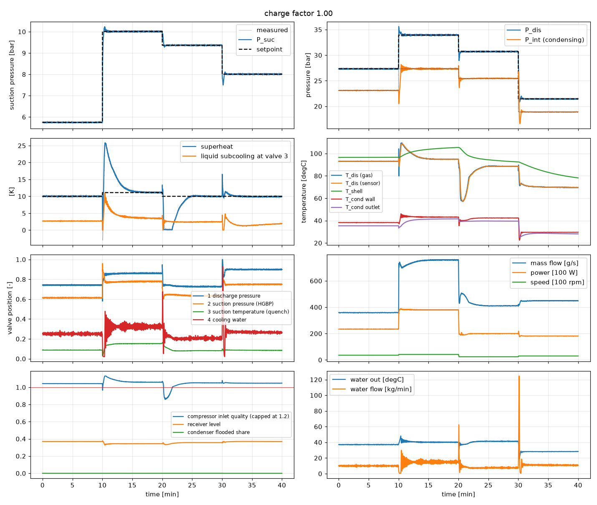
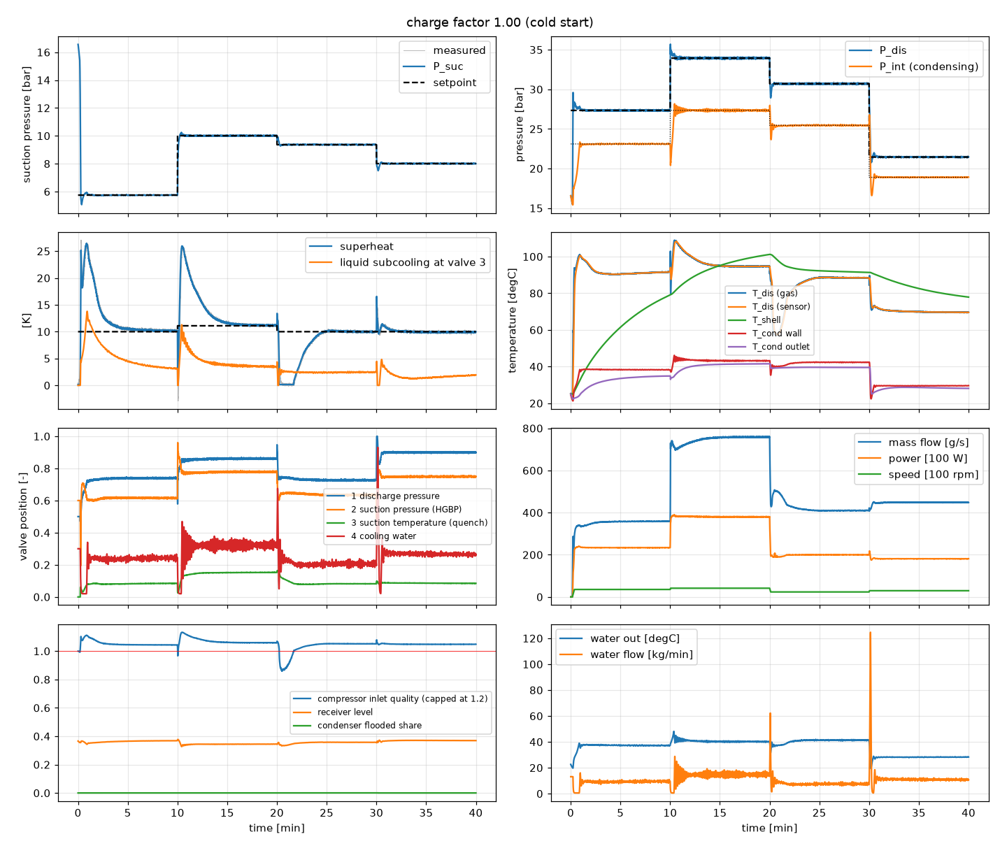
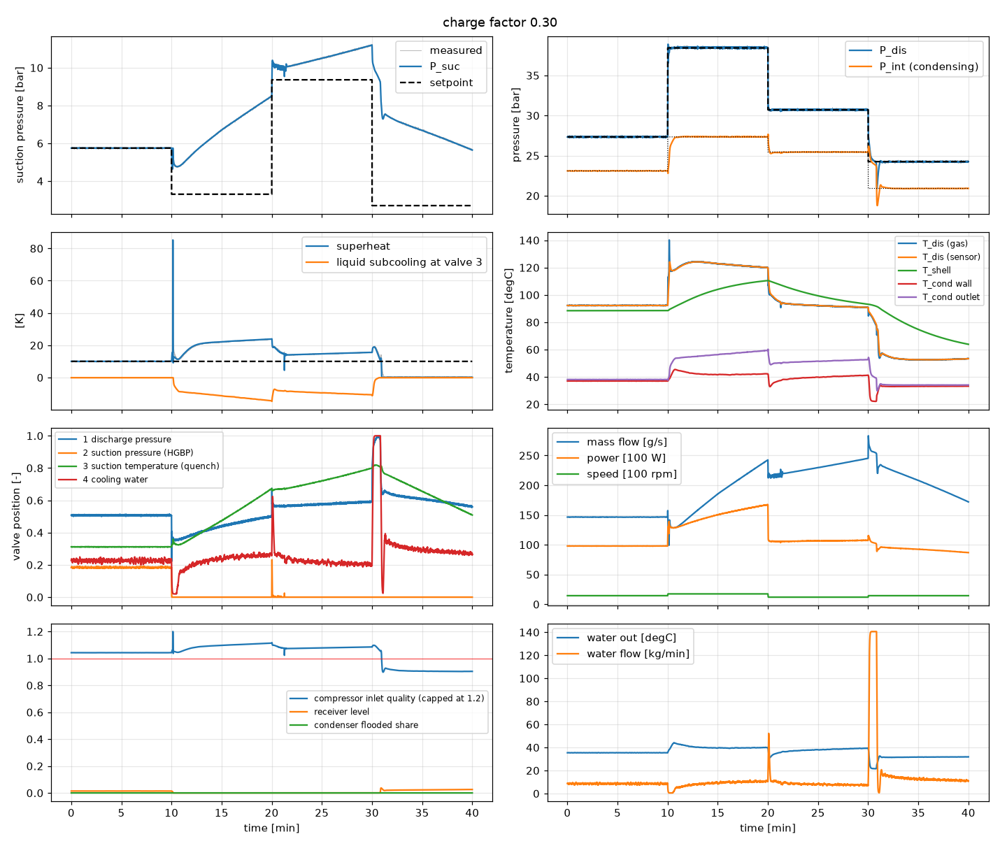
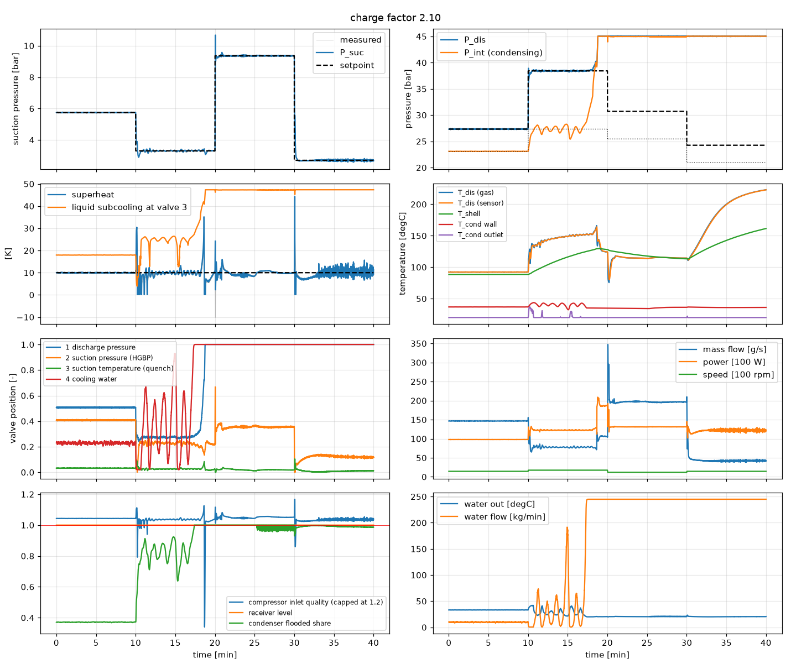
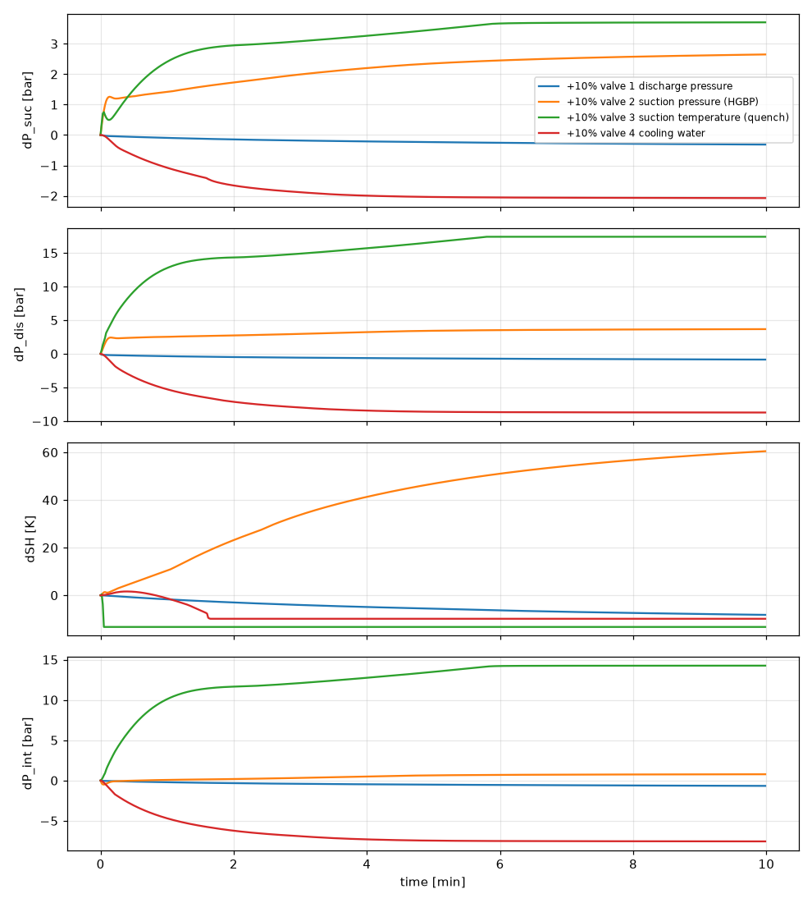

# hgbp-sim

Dynamic, transient simulation of a **hot-gas-bypass (HGBP) refrigeration compressor
test stand**, built for training and evaluating neural-network / reinforcement-learning
controllers that automate compressor performance testing.

* physics-based lumped-parameter model (mass & energy balances on refrigerant volumes,
  thermal masses, real-fluid properties via tabulated CoolProp data)
* the stand as built: brazed-plate condenser, liquid **receiver**, and a brazed-plate
  **mixing exchanger** where hot bypass gas evaporates the liquid quench in counterflow
  before the two streams join at a tee; volumes and heat capacities follow from the
  specified components and piping (see `docs/STAND_MODEL.md`)
* total refrigerant **charge is a parameter**: undercharged and overcharged stands behave
  differently (receiver level, loss of the liquid seal, condenser flooding and loss of
  condensing area, subcooling, quench liquid reaching the compressor)
* fully **vectorized**: thousands of stands integrate in lock-step with numpy
  (about 1 000 control steps / s at 1024 parallel environments on a laptop; the live
  stand runs 10-20 times faster than real time)
* `gymnasium`-compatible single environment plus a batched environment for
  high-throughput training, with refrigerant-agnostic observations (saturation
  temperatures, normalized flow and power, compressor and refrigerant context), an
  interlocked compressor start/stop action, dwell-based test-point completion and
  training labels for a charge estimator
* baseline four-loop PID controller (expert for imitation learning, reference for RL)
* a controller specification for the neural-network development
  (`docs/NN_CONTROLLER_SPEC.md`)
* steady-state solver for warm starts, feasibility checks and performance maps
* domain randomization of plant parameters, charge, sensor noise/lag, actuator dynamics

## The stand

```
compressor --> discharge line --> valve 1 --> hot gas header (intermediate pressure P_int)
                                                 |                         |
                                              valve 2              condenser (BPHE) <-- water, valve 4
                                                 |                         |
                                                 |                  receiver (dip tube)
                                                 |                         |
                                                 |                      valve 3
                                                 v                         v
                                   mixing exchanger (BPHE), counterflow
                            gas: S1 (bottom) -> S2 (top)   quench: S3 (top) -> S4 (bottom)
                                                 \__________ tee __________/
                                                             |
                                     suction line -> probe -> compressor suction
```

| valve | installed on | controls |
|---|---|---|
| 1 | discharge line, upstream of the split | discharge pressure |
| 2 | hot gas bypass line into the mixing exchanger (gas side) | suction pressure |
| 3 | liquid line from the receiver into the mixing exchanger (quench side) | suction temperature / superheat |
| 4 | cooling water inlet of the condenser | intermediate (condensing) pressure |

Condenser and mixing exchanger are Alfa Laval ACH-70X-78M-F, the receiver a Standard
Refrigeration UR66; there is no suction accumulator, so quench liquid that the mixing
exchanger does not evaporate reaches the compressor.

The compressor speed follows the test schedule (an exogenous input). A test point is
(P_suc, P_dis, superheat, P_int, speed).

## Installation

```bash
python -m venv .venv && source .venv/bin/activate
pip install -e ".[dev]"          # numpy + CoolProp + gymnasium + matplotlib + pytest
pytest                            # ~7 min
```

Only `numpy` is required at run time. Prebuilt R410A (the default) and R134a property
tables ship with the package (`hgbp_sim/data/`). Any other CoolProp fluid (`R404A`,
`R32`, `R290`, `R1234yf`, ...) is tabulated on first use (needs CoolProp, takes a few
seconds, cached in `~/.cache/hgbp_sim/`).

## Quick start

```python
from hgbp_sim import HGBPEnv, EnvConfig

env = HGBPEnv(EnvConfig(action_mode="incremental"))
obs, info = env.reset(seed=0)
for _ in range(2400):                       # 600 s at the 0.25 s control interval
    action = env.expert_action()            # baseline PID; replace with your policy
    obs, reward, terminated, truncated, info = env.step(action)
    if terminated or truncated:
        break
print(info["true"])                          # noise-free process values incl. charge, fills
```

High-throughput batched environment (recommended for training):

```python
from hgbp_sim import HGBPVecEnv, EnvConfig
env = HGBPVecEnv(1024, EnvConfig(), seed=0)
obs = env.reset()                            # (1024, 51)
obs, r, term, trunc, info = env.step(actions)   # actions (1024, 4) in [-1, 1] (5 with start_stop_action)
```

Direct plant access (custom experiments, MPC, system identification):

```python
from hgbp_sim import HGBPPlant, PlantParams, BaselineController, solve_steady_state, named_point
plant = HGBPPlant(PlantParams(), n=1, dt=0.05)
plant.p.charge[:] = plant.nominal_charge() * 1.2                # 20 % overcharged
plant.set_inputs(T_amb=298.15, T_wi=293.15)
pt = named_point("MT_standard", plant.props, N=1450.0)         # -10 / 45 degC, 10 K SH, 38 degC condensing
ss = solve_steady_state(plant, pt["P_s"], pt["P_d"], pt["SH"], pt["N"], P_i=pt["P_i"])
plant.set_state(0, ss["x"])
aux = plant.step(1.0, u_cmd=ss["u"], N_cmd=pt["N"])             # advance 1 s
meas = plant.measure()                                           # noisy, lagged sensor readings
```

Examples (`examples/`):

| script | what it does |
|---|---|
| `closed_loop_pid.py [--cold] [--charge F]` | PID baseline through a 4-point schedule at charge factor F, plots everything |
| `open_loop_step.py` | +10 % step on each valve from a steady point (shows MIMO coupling) |
| `collect_dataset.py` | expert + exploration noise data from the batched env -> `.npz` |
| `train_bc.py` | behaviour-cloning MLP (PyTorch) and closed-loop evaluation vs expert |
| `benchmark.py` | throughput vs batch size |

## Example runs

Baseline PID through four test points (MT standard -> high lift at 1750 rpm -> HT
standard at 1200 rpm -> LT standard), nominal charge, warm start. Grey traces are the
noisy sensor readings, dashed lines the setpoints
(`python examples/closed_loop_pid.py`):



Same schedule from a cold, equalized stand with the compressor started at 10 s; the
shell and discharge temperature take tens of minutes to settle (`--cold`):



Undercharged stand (30 % of nominal): the receiver level falls below the dip tube and
valve 3 passes vapor (negative "subcooling" is that vapor's superheat), so the quench
cannot cool the bypass gas: superheat runs high and the suction pressure loop loses the
point (`--charge 0.3`):



Overcharged stand (210 % of nominal): the receiver is full and liquid floods the
condenser. At the high-lift point the flooding changes the condensing area and the water
loop starts to cycle; after about 17 minutes the condenser is liquid-logged, the water
valve saturates and the intermediate and discharge pressures run up (the stand would trip
at 41.4 bar; the example does not enforce trips) (`--charge 2.1`):



Open-loop +10 % steps on each valve from the MT standard point: every valve moves every
controlled variable (`python examples/open_loop_step.py`):



## Live stand web UI (`webui/`)

A browser-based operator interface to run the simulated stand like the real one:
an **Operator** tab with a live schematic, four PID faceplates (auto/manual, setpoint,
manual output, live tuning), the compressor start/stop panel with interlock permissives
and trip reset, process-value tiles and charging/recovery buttons; a **Trends** tab with
live time-series charts (pressures with setpoints, superheat/subcooling, valves,
temperatures, flow/power/speed, inventory) and CSV export; and a **Settings** tab for
simulation speed, noise, ambient and water temperature, PID tuning and every plant
parameter (grouped, with units, descriptions and defaults; refrigerant, volumes and
charge are applied at the next cold or warm start).

**PID tuning in UT35A units.** Each loop is tuned the way the stand's Yokogawa UT35A
controllers are (IM 05P01D31-01EN, 6.4 and 8.3): `P` proportional band in % of the PV
input range `RL..RH` (0.1-999.9 %, 0.1 % steps), `I` integral and `D` derivative time in
seconds (1-6000 s or OFF), `DR` direct (`DIR`, output rises with PV) or reverse (`RVS`)
action, PV-derivative PID as in the controller's standard mode, output limits `OL..OH`.
A setting read off a real controller carries over directly, provided `RL..RH` matches that
controller's input range. `hgbp_sim.ut35a` converts to the simulator's internal gains
(`|Kp| = 100 / (P * span)`, `Ki = Kp / Ti`, `Kd = Kp * Td`). Setpoints are held inside the
input range, as on the controller. The default control interval is 0.2 s, the UT35A's
control period.

**Loops run whenever they are in AUTO**, compressor on or off, as the stand's controllers
do. At standstill the pressures are far from their setpoints, so the loops drive their
valves to a limit (valves 1, 2 and 4 closed, the liquid valve open) and the start
permissives (valve 1 at least 10 %, valve 2 at least 5 % open) fail. To start: put the four
loops in MAN at start positions (for example 50 / 60 / 0 / 30 %), request the run, and
switch them to AUTO once the compressor turns (about 600 rpm). In AUTO before that, the
discharge loop closes valve 1 against the starting compressor and the stand trips on high
discharge pressure within seconds. The anti-short-cycle timers (60 s minimum off time,
120 s minimum run time) can be switched off on the Settings tab.

**Defaults file.** All defaults (simulation settings, the four loops with setpoint,
tuning, action, input range and output limits, and every plant parameter) come from one
JSON file, `webui/config/stand_defaults.json`, which docker compose bind-mounts at
`/config` (`HGBP_DEFAULTS=/config/stand_defaults.json`). Edit it on the host and restart
(`docker compose -f webui/docker-compose.yml restart`). Keys left out keep their built-in
value; an unknown key or an out-of-range value stops the backend with a message naming it
(`docker compose -f webui/docker-compose.yml logs`). If the file is missing it is created
from the built-in defaults, which `python -m hgbp_sim.defaults <path>` also writes. The
Settings tab's *defaults* buttons restore the file's values. Units are listed in the
file's `_about` entry: loop setpoints and ranges are in bar absolute or degC, plant
parameters in SI.

```bash
# in Docker (builds the React app and the Python backend)
docker compose -f webui/docker-compose.yml up --build      # then open http://localhost:8000

# or locally for development
pip install -e ".[dev]" fastapi "uvicorn[standard]"
uvicorn webui.backend.app:app --reload --port 8000           # API + WebSocket
cd webui/frontend && npm install && npm run dev              # UI on http://localhost:5173 (proxies to 8000)
```

The image builds natively on x86-64 (Intel/AMD) and arm64 hosts: both base images are
multi-architecture and every Python dependency (numpy, CoolProp, FastAPI) ships wheels for
both. To build an x86-64 image on an Apple Silicon machine for an Intel target, add
`--platform linux/amd64` to `docker build` (or `platform: linux/amd64` to the compose
service).

The engine behind the UI is `hgbp_sim.live.LiveStand` (one plant, four PID loops with
bumpless auto/manual transfer, the same start/stop interlock as the training
environment, trip latching, charge changes while running, a rolling history), which can
also be scripted directly. As on the real stand, the third loop controls the suction
*temperature* (setpoint in degC; a warm start derives it from the test point's
superheat), whereas the training environment's baseline expert works on superheat. The backend (`webui/backend/app.py`) exposes a small REST API
(`/api/state`, `/api/loop/{name}` (mode, sp, out, P, I, D), `/api/compressor`, `/api/sim`, `/api/init`,
`/api/params`, `/api/charge`, `/api/history`, `/api/export.csv`) and streams one
snapshot per control step on `/ws`.

## Model

### Refrigerant properties (`properties.py`)
CoolProp is far too slow inside an ODE right-hand side, so properties come from
bilinear interpolation tables aligned with the saturation dome (superheated and
subcooled regions in `(log P, zeta)` coordinates, two-phase analytic). Accuracy vs
CoolProp for R134a: temperature < 0.04 K, density < 0.1 %. The tables also provide the
partial derivatives `drho/dP|h`, `drho/dh|P` needed by the volume balances, and the
inversions `h(P, s)`, `h(P, T)` and `h(P, rho)`.

### Control volumes
Full description: `docs/STAND_MODEL.md`.

* **discharge volume** (3.6 L): compressor internal discharge volume and discharge line.
* **intermediate section** (33 L): header, condenser (refrigerant side), drain, receiver
  and liquid line, one volume in equilibrium. Liquid collects in the receiver first (the
  liquid line fills once the level is above the dip tube), then backs up through the
  drain into the condenser, where it removes condensing area and forms a subcooled zone
  against the entering water. Below the dip tube vapor enters the liquid line and valve 3
  loses its liquid seal.
* **suction side** (18 L), one common pressure: five finite-volume cells on the quench
  side of the mixing exchanger with a plate wall per cell, a quasi-steady bypass gas side
  marched against the same walls (counterflow), the tee and suction line, and the
  compressor's internal suction volume. Liquid leaving the quench side travels as
  droplets that evaporate on the way to the suction probe.

```
mass    : V (drho/dP|h dP/dt + drho/dh|P dh/dt) = sum(m_in) - sum(m_out)
energy  : M dh/dt = sum(m_in (h_in - h)) - sum(m_out (h_out - h)) + Q + V dP/dt
```

### Charge
`PlantParams.charge` (kg) is the total refrigerant mass; `None` (default) means the
nominal charge (`nominal_charge()`: vapor at a medium-temperature condition, a full
liquid line and the receiver 40 % full, 14.2 kg for the defaults). At a cold start the
liquid sits in the receiver; a share `cold_liquid_in_suction` can be placed on the
suction side (compressor first), as after refrigerant migration during a long off
cycle. A charge too small to reach saturation at ambient leaves the stand with
superheated vapor at a lower pressure. In steady state the charge fixes the receiver
level (the solver takes `charge=` or a receiver level `fill=`). How the nominal charge
is defined: `docs/REFRIGERANT_CHARGE.md`.

The receiver makes the stand tolerant of the charge: between about 0.4 and 2.1 times
the nominal charge only the receiver level changes, and condensing area, subcooling and
water valve position stay the same. Beyond that the receiver is full and liquid floods
the condenser (overcharge); below it the liquid seal is lost (undercharge).

### Compressor
Quasi-steady map: volumetric efficiency with clearance re-expansion
`eta_v = eta_v0 - c_cl (Pr^(1/kappa) - 1)`, isentropic efficiency as a parabola in
pressure ratio and speed, motor/VFD efficiency with a configurable fraction of the motor
loss heating the suction gas, discharge gas to shell heat exchange (effectiveness form),
shell thermal mass and losses to ambient, VFD speed ramp and lag. Discharge temperature
therefore shows the slow warm-up seen on real stands.

### Valves, condenser, actuators
Valves 1 and 2: ISA-style compressible flow with choking. Valve 3: incompressible /
flashing orifice. Valve 4: equal-percentage water valve; condenser wall thermal mass,
regime- and fill-dependent refrigerant-side UA and effectiveness-NTU water side. All
actuators have first-order lag and slew-rate limits; equal-percentage or linear
characteristics are selectable.

### Sensors and safety
Pressure transducers (noise), temperature sensors at the compressor suction port (the
probe at the end of the suction line), discharge and the liquid line at valve 3
(first-order lag + noise), Coriolis flow meter and power meter (lag + relative noise),
receiver sight glass. Trips: high discharge pressure, high discharge temperature,
low/high suction pressure. Flags: liquid at the compressor (floodback), quench liquid
leaving the mixing exchanger, no liquid seal (undercharge), receiver full and condenser
flooding (overcharge).

### Integrator and mass conservation
Fixed-step RK4 (default `dt = 0.05 s`) with automatic sub-stepping: the right-hand side
estimates the fastest local rate (valve conductance over the capacitance of each
pressure node, advection, heat transfer and dry-out switching in the quench cells) and
each step is split until rate x sub-step stays inside RK4's stable range; liquid-full
volumes take at least four sub-steps. Mass and internal energy of every volume (the
suction side as one group) are integrated as conserved states, and after every sub-step
(P, h) are projected back onto them: the total charge is conserved to machine
precision, and overcharging until the condenser floods drives the pressure up until the
discharge-pressure trip, as on a real stand.

## Environment (`env.py`)

**Observation** (51 values, scaled to O(1), names in `hgbp_sim.OBS_NAMES`, groups in
`OBS_GROUPS`): measurements in refrigerant-agnostic form (pressures as saturation
temperatures, superheat, subcooling, mass flow normalized by swept volume x speed x
suction vapor density, power normalized by swept volume x speed x suction pressure,
temperatures, speed, valve positions), setpoints, tracking errors and clipped integrated
errors in kelvin, context (swept volume, nominal speed, eight physical refrigerant
descriptors) and the status of the start/stop interlock. One environment instance is one
refrigerant; run one instance per fluid to train across refrigerants.

**Action**: 4 values in `[-1, 1]` for valves 1..4, plus an optional 5th run-request
action (`start_stop_action=True`). `action_mode="incremental"` (default) moves each
valve command by `a * max_rate`; `"absolute"` maps to the command directly. An interlock
state machine (OFF / STARTING / RUNNING / STOPPING with permissives and anti-short-cycle
timers) has authority over the compressor; without the run action the compressor is
started automatically and stopped after the last point.

**Episodes**: 1-3 test points sampled from `Envelope` (evaporating -30..12 degC,
condensing 30..65 degC, superheat 3..25 K, intermediate temperature between the cooling
water and the condensing temperature, 50-140 % speed, feasibility filters including an
estimated discharge temperature and an equilibrium check at nominal charge). A point is
completed once the three test variables have
stayed inside the tolerance band (0.3 K, 0.2 K, 0.5 K) for `dwell_required` seconds, or
when its maximum hold time elapses; after the last point the compressor must be stopped
and the episode terminates successfully. Start modes: `warm` (equilibrium at the first
point or at a random other point, via the steady-state solver), `cold` (equalized stand
at ambient, liquid in the receiver, optionally some migrated to the suction side), or
`random`. Per episode the physical
parameters, ambient and water temperatures, the charge (`charge_range`, plus a share
`p_charge_extreme` of episodes in `charge_extreme_range`) and the cold-start liquid
distribution are randomized.

**Reward** (per step, weights in `EnvConfig`): minus the normalized tracking errors in
kelvin (the intermediate pressure with half weight), a bonus inside the tolerance band, a
bonus when a point completes by dwell, an actuator-movement penalty, penalties for liquid
at the compressor inlet, for approaching the discharge temperature limit, for idling when
a start is possible, for blocked start requests and for running during shutdown, a
shutdown bonus, and a large penalty plus termination on a safety trip.

`info` carries noise-free process values, the true charge factor and a `steady` flag
(labels for a charge estimator), privileged states for an asymmetric critic, and every
reward component. `env.expert_action()` returns the baseline PID action (and run
request) in the env's action space, for behaviour cloning, DAgger or reward shaping.

The controller architecture, training plan, safety predicates and deployment path built
on this interface are specified in `docs/NN_CONTROLLER_SPEC.md`.

## Baseline controller

Four PI loops (`control.py`, gains tuned by batched sweeps over the 4-point schedule of
`examples/closed_loop_pid.py`): discharge pressure -> valve 1, suction pressure -> valve
2, superheat -> valve 3, intermediate pressure -> valve 4. The superheat loop is slow on
purpose (integral time 60 s): the suction temperature responds to valve 3 over about a
minute because the mixing exchanger's plates have to change temperature, and a faster
loop limit-cycles into floodback. The open-loop step responses
(`examples/open_loop_step.py`) show the coupling a coordinated (learned) controller can
exploit: every valve moves suction pressure, discharge pressure and superheat together.

## Key parameters (`PlantParams`)

| group | parameters |
|---|---|
| compressor | `V_disp` (355 cm3/rev), `N_nom` (3550 rpm), `eta_v0`, `c_cl`, `eta_s0`, `a_s`, `Pr_opt`, `eta_motor`, `f_motor_gas`, `C_shell`, `UA_gs`, `UA_sha`, `ramp_N` |
| compressor volumes | `V_comp_suc` (5 L, behind the suction probe), `V_comp_dis` |
| piping | `D_*`, `t_*`, `L_*` (outside diameter, wall, length) for the discharge, header, bypass, quench, exchanger outlet, suction, drain and liquid lines |
| charge | `charge`, `cold_liquid_in_suction` |
| condenser | `cond_n_plates`, `cond_V_ch`, `cond_A`, `cond_mass`, `alpha_r_2ph`, `alpha_r_1ph`, `alpha_sc`, `cond_sc_film`, `alpha_w0`, `mdot_w_ref`, `UA_ca` |
| receiver | `rec_V` (26.5 L), `rec_dip`, `rec_mass`, `rec_UA_r`, `rec_UA_a` |
| mixing exchanger | `mx_n_plates`, `mx_V_ch`, `mx_A`, `mx_mass`, `mx_alpha_g0`, `mx_alpha_e`, `mx_alpha_v0`, `mx_mdot_g_ref`, `mx_mdot_q_ref`, `mx_UA_a`, `tee_tau_evap` |
| pipe walls | `UA_sg`, `UA_sa`, `UA_dg`, `UA_da` (heat capacities follow from the tube data) |
| valves | `Kv_dpv`, `Kv_spv`, `Kv_stv`, `Kv_w` in m3/h (+ characteristic, `tau_*`, `rate_*`), water supply `P_w_sup` |
| sensors | `tau_T`, `tau_m`, `tau_W`, `sig_*` |
| limits | `P_d_max`, `P_s_min`, `P_s_max`, `T_d_max`, `y_flood` |

Defaults describe a variable-speed 355 cm3/rev semi-hermetic compressor on R410A. All
four valves are sized by their `Kv` (m3/h of water at a 1 bar drop), the way the hardware
is specified; internally `mdot = (Kv / 36000) f(u) sqrt(rho dP)`. The cooling water valve
uses the same relation against a fixed supply pressure `P_w_sup` (1.5 bar by default).
Fit `V_disp`, the efficiency coefficients, piping and valve Kv values to your compressor
and stand; the steady-state solver plus `open_loop_step.py` make this quick.

## Assumptions and limitations

* the condenser, receiver and lines are one equilibrium volume (no stratified, subcooled
  receiver pool); the mixing exchanger is discretized into five cells per side
* no oil, no pressure drops inside the suction side, no suction-gas heater
* compressor map is generic; replace `components.compressor` for a measured map
* water inlet temperature and ambient are constant within an episode (easy to make
  time-varying via `plant.set_inputs`)
* property tables cover 0.2 bar .. 0.92 P_crit and up to the equation-of-state
  temperature limit; states are clamped to the table range
* mixtures with glide (R407C, R448A) work through CoolProp pseudo-pure/HEOS tables but the
  two-phase temperature is a linear interpolation between bubble and dew

## License

MIT, see `LICENSE`.

## Layout

```
hgbp_sim/
  properties.py    tabulated refrigerant properties (build from CoolProp, cached)
  params.py        PlantParams dataclass, randomization, nominal charge
  geometry.py      volumes and heat capacities from the component and piping specification
  components.py    valves, actuators, compressor map, control-volume balance
  plant.py         HGBPPlant: batched ODE model, integrator, cold start, sensors, trips
  steady_state.py  batched equilibrium solver (charge- or receiver-level-constrained)
  control.py       PID and 4-loop BaselineController
  scenarios.py     operating envelope, named points, schedules
  env.py           HGBPVecEnv (batched) and HGBPEnv (gymnasium)
  interlock.py     compressor start/stop interlock state machine (shared by env and live stand)
  live.py          LiveStand: interactive single stand with PID loops, charging, history
  ut35a.py         Yokogawa UT35A tuning (P band %, I/D s, DIR/RVS) <-> internal PID gains
  defaults.py      stand defaults document: built-in values, JSON file loading and validation
  data/            prebuilt property tables
webui/             React + FastAPI operator interface, Dockerfile, docker-compose.yml,
                   config/stand_defaults.json (bind-mounted defaults)
docs/              STAND_MODEL.md: the stand model (receiver, mixing exchanger, piping, numerics);
                   NN_CONTROLLER_SPEC.md: controller architecture, training and deployment spec;
                   REFRIGERANT_CHARGE.md: how the nominal charge is calculated;
                   SUCTION_MIXER_ANALYSIS.md: review of the former suction tank model (superseded)
examples/          closed-loop, open-loop, dataset, behaviour cloning, benchmark
tests/             property accuracy, conservation, charge effects, steady state, controllers, env API
```
