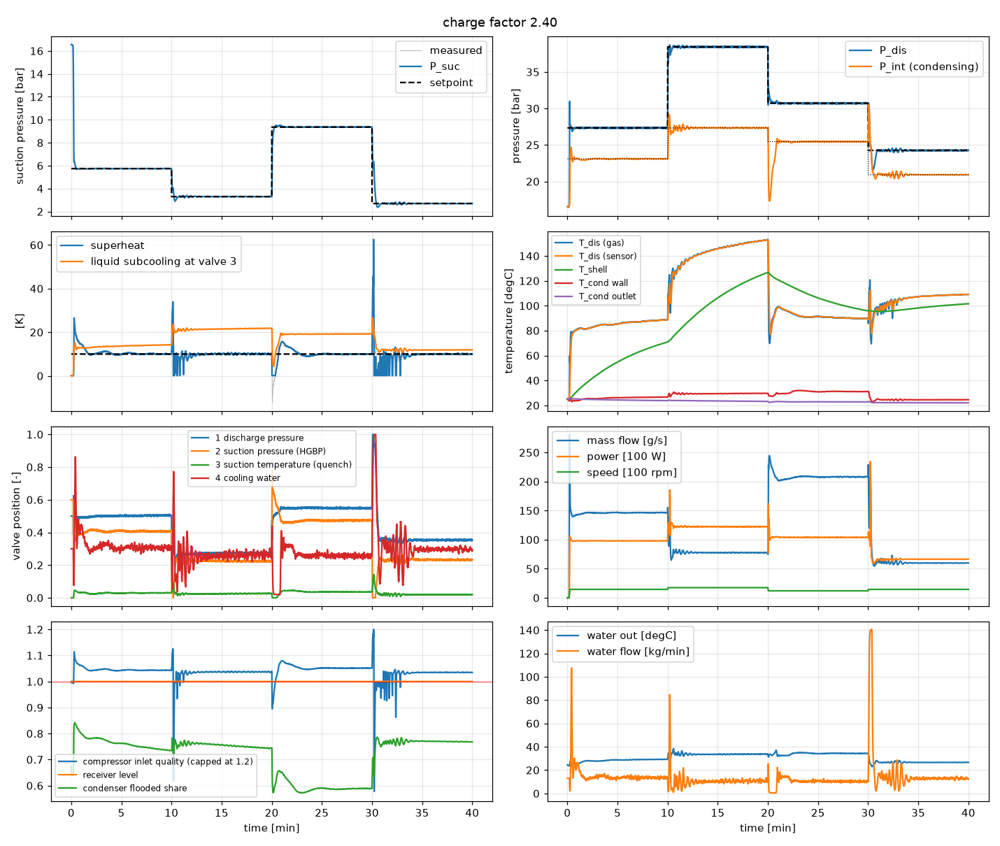

# Examples

Scripts in `examples/`:

| script | what it does |
|---|---|
| `closed_loop_pid.py [--cold] [--charge F]` | baseline PID through a 4-point schedule at charge factor F; plots everything |
| `open_loop_step.py` | +10 % step on each valve from a steady point |
| `collect_dataset.py` | expert plus exploration noise data from the batched environment -> `.npz` |
| `train_bc.py` | behaviour-cloning MLP (PyTorch) and closed-loop evaluation against the expert |
| `benchmark.py` | speed of the live stand, the batched environment and the steady-state solver |

## Direct plant access

For custom experiments, MPC or system identification:

```python
from hgbp_sim import HGBPPlant, PlantParams, solve_steady_state, named_point

plant = HGBPPlant(PlantParams(), n=1, dt=0.05)
plant.p.charge[:] = plant.nominal_charge() * 1.2                # 20 % overcharged
plant.set_inputs(T_amb=298.15, T_wi=293.15)
pt = named_point("MT_standard", plant.props, N=1450.0)         # -10 / 45 °C, 10 K SH, 38 °C condensing
ss = solve_steady_state(plant, pt["P_s"], pt["P_d"], pt["SH"], pt["N"], P_i=pt["P_i"])
plant.set_state(0, ss["x"])
aux = plant.step(1.0, u_cmd=ss["u"], N_cmd=pt["N"])             # advance 1 s
meas = plant.measure()                                           # noisy, lagged sensor readings
```

## Closed loop with the baseline PID

Four test points (MT standard -> high lift at 1750 rpm -> HT standard at 1200 rpm -> LT
standard), nominal charge, warm start. Grey traces are the noisy sensor readings, dashed
lines the setpoints (`python examples/closed_loop_pid.py`).

The subcooling at valve 3 follows the receiver. At 10 min the intermediate pressure rises
and leaves the receiver liquid subcooled: about 7 K, decaying over ten minutes. At 30 min
it falls, and the liquid flashes: no subcooling until the receiver has cooled to the new
saturation temperature.


The same schedule from a cold, equalized stand, compressor started at 10 s. The shell and
discharge temperatures take tens of minutes to settle. As the intermediate pressure builds
over the receiver's liquid, which is still at ambient temperature, the subcooling jumps to
about 11 K and relaxes over ten minutes (`--cold`):


Undercharged (30 % of nominal): the receiver level falls below the dip tube and valve 3
passes vapor (the negative "subcooling" is that vapor's superheat). The quench cannot cool
the bypass gas, so superheat runs high and the suction pressure loop loses the point
(`--charge 0.3`):


Overcharged (240 % of nominal). There is no steady state at the first point with this
charge, so the run starts cold. The receiver is full, and the blocked drain floods 60-85 %
of the condenser. The condensate draining through the flooded plates subcools by 13-22 K.
The water loop cycles at the high-lift and LT points but holds every point: the colder,
denser receiver liquid takes back part of the charge (`--charge 2.4`):



## Open-loop steps

+10 % on each valve from the MT standard point: every valve moves every controlled
variable (`python examples/open_loop_step.py`):


