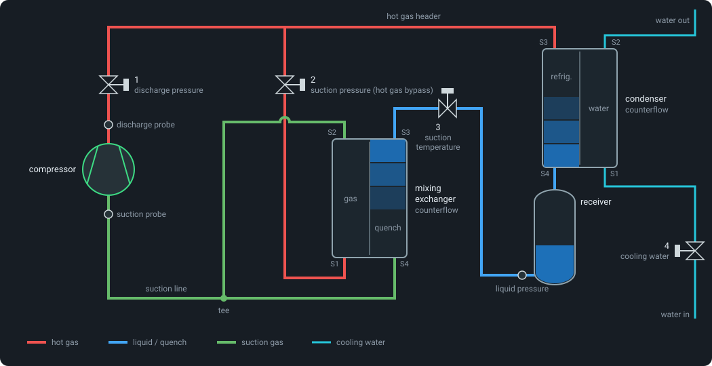

# The stand model

What the simulator represents and how. Pressure drops and the charge have their own
pages: [pressure-drop.md](pressure-drop.md), [charge.md](charge.md).

## Hardware



* **Condenser and mixing exchanger:** both Alfa Laval ACH-70X-78M-F (drawing
  `3287083725`). 78 plates form 77 channels: 39 on S1-S2 and 38 on S3-S4, 0.095 L each
  (3.71 L and 3.61 L per side). Heating surface 6.588 m², net weight 16.19 kg.
  * The drawing says "6.588 ft²". That can only be m²: 0.18 kg per plate of 0.25 mm
    stainless steel is about 0.087 m² per plate, and 76 × 0.087 = 6.6 m².
  * S3-S4 (with the 7/8 in N60 distributor at S3) carries the refrigerant in the condenser
    and the quench in the mixing exchanger; S1-S2 carries the water and the bypass gas.
* **Receiver:** Standard Refrigeration UR66 (MP), about 26.5 L inside (its pumpdown rating
  of 61 lb R22 at 90 % full, 90 °F). The outlet is a dip tube whose inlet sits at
  `rec_dip` (4 %) of the volume.
* **Compressor:** 5 L internal suction volume behind the suction port and probe; 1.5 L
  internal discharge volume (estimate). It draws in at most 30 % liquid by mass
  (`comp_x_min` = 0.7); more liquid collects in its shell.
* **Piping:** copper, ACR type L. Each line is `D_*` (outside diameter), `t_*` (wall),
  `L_*` (length) and `K_*` (fittings loss):

| line | size | length | volume |
|---|---|---|---|
| discharge (compressor -> valve 1) | 1-1/8 in | 4 m | 2.13 L |
| hot gas header (valve 1 -> condenser, valve 2) | 1-1/8 in | 4 m | 2.13 L |
| bypass (valve 2 -> S1) | 1-1/8 in | 0.5 m (estimate) | 0.27 L |
| quench (valve 3 -> S3) | 7/8 in | 0.5 m (estimate) | 0.16 L |
| exchanger outlets (S2, S4 -> tee) | 1-3/8 in | 1 m (estimate) | 0.81 L |
| suction (tee -> compressor) | 1-5/8 in | 4 m | 4.59 L |
| condensate drain (condenser -> receiver) | 7/8 in | 0.5 m (estimate) | 0.16 L |
| liquid line (receiver -> valve 3) | 7/8 in | 3 m | 0.94 L |

These give the model's volumes (`hgbp_sim/geometry.py`, also on the web UI's Settings
tab):

| volume | contents | size |
|---|---|---|
| suction side | mixing exchanger, tee, suction line, compressor inside | 18.1 L |
| discharge | compressor inside, discharge line | 3.6 L |
| intermediate section | header, condenser, drain, receiver, liquid line | 33.3 L |

Heat capacities follow from the same data: condenser plates plus water content
23.6 kJ/K, exchanger plates 8.1 kJ/K (both split over their cells), suction and discharge line
copper 3.1 and 1.5 kJ/K, receiver shell 12 kJ/K (25 kg of steel, estimate).

## Model structure

Every volume $`V`$ with pressure $`P`$, enthalpy $`h`$, density $`\rho(P, h)`$ and mass
$`M = \rho V`$ has a mass and an energy balance:

```math
V \left( \frac{\partial \rho}{\partial P}\bigg|_h \frac{dP}{dt} + \frac{\partial \rho}{\partial h}\bigg|_P \frac{dh}{dt} \right)
  = \sum \dot m_\mathrm{in} - \sum \dot m_\mathrm{out}
```

```math
M \frac{dh}{dt} = \sum \dot m_\mathrm{in} \left( h_\mathrm{in} - h \right)
  - \sum \dot m_\mathrm{out} \left( h_\mathrm{out} - h \right) + \dot Q + V \frac{dP}{dt}
```

### Intermediate section and receiver
One (P, h) volume in equilibrium. Its liquid is placed where it actually sits, in this
order: the receiver up to the dip tube inlet, the liquid line, the rest of the receiver,
the drain, the condenser plates, the header. So:
* the condenser keeps its full condensing area until the receiver is full; then liquid
  floods the plates, removing condensing area and growing a subcooled zone;
* below the dip tube, vapor enters the liquid line and valve 3 loses its liquid seal
  (flag `no_liquid_seal`);
* the draining condensate is subcooled on a small share `cond_sc_film` (2 %) of the plate
  area at the water inlet end, which sets the subcooling seen at valve 3;
* a receiver shell temperature exchanges heat with the refrigerant and ambient; the level
  is reported as a sight glass reading (`rec_level`).

### Condenser
The same five-cell layout as the mixing exchanger, top (S3) to bottom (S4), each cell with
its own plate wall temperature (plates plus water content). The refrigerant in it belongs
to the intermediate section (its mass, pressure `P_i` and the flooding above); the flow
through it is quasi-steady:
* **refrigerant side** (S3 -> S4), marched down the cells: hot gas from the header enters
  at S3 and leaves the last cell above the liquid at the bubble point, so the flow is
  what the plates condense ($`\dot m (h_\mathrm{in} - h_l) = \sum \dot Q`$; it equals the
  quench flow in steady state). A wall below the condensing temperature is wet: vapor
  condenses on it (`alpha_r_2ph`, driven by the condensing temperature, which follows the
  glide of a blend), and superheated vapor gives up its superheat to the condensate
  (`alpha_r_1ph`, wet-wall desuperheating). A wall above it stays dry and only exchanges
  sensible heat with the vapor. Every cell reports its quality (`x_c`) and temperature;
* **flooded cells**: liquid backing up from a full receiver fills the cells from the
  bottom and joins the subcooled zone (below);
* **water side** (S1 -> S2, counterflow): the water first subcools the leaving liquid
  (the subcooled zone at its inlet end), then rises through the wall cells
  (effectiveness-NTU per cell, `alpha_w0` scaling with flow^0.8).

At the rating point the hot gas enters at 77 °C, 49 K superheated; the top wall runs above
the saturation temperature (dry desuperheating), the cells below condense.

**Compared with the mixing exchanger's quench side.** Both have five cells with their own
plate walls and a counterflow stream on the other side, but the quench cells are dynamic
finite volumes while the condenser's refrigerant side is quasi-steady, like the mixer's
gas side:

| | quench side | condenser, refrigerant side |
|---|---|---|
| cell states | enthalpy per cell, integrated | none: the profile follows the walls at every evaluation |
| mass and energy | per cell, in the suction side's conserved group | the intermediate section's single equilibrium volume |
| liquid hold-up | per cell, counted in the charge | only when flooded; the condensing film is not counted |
| flow | valve 3 and the pressure solve (can reverse between cells) | what the plates condense |
| transport delay | yes (part of the valve 3 -> suction temperature response) | none; the dynamics come from the wall mass only |
| pressure | each cell at its own pressure (static head, friction from the plate geometry) | all cells at `P_i`; lumped `cond_Kv_r` drop |
| regime change | dry-out share of the cell's area, blended over 15 kJ/kg | wet / dry wall, a sharp switch |
| coefficients | scale with flow (`mx_alpha_e` ^0.5, `mx_alpha_v0` ^0.8) | constant (`alpha_r_2ph`, `alpha_r_1ph`); water side ^0.8 |
| steady-state solver | own inner solve (`march_mixer`, `newton_mixer`) | wall temperatures as outer unknowns |
| displayed per cell | the cell's state (= its outlet) | the cell's mean above the liquid |

This keeps the intermediate section's inventory, flooding and subcooling (`cond_sc_film`)
unchanged. The cost is the refrigerant-side lag inside the condenser, which matters less
for the condensing pressure than the quench side's lag does for the suction temperature:
the plates and their water (23.6 kJ/K) dominate the condenser's response.

**Possible improvements** (in increasing effort):
* scale `alpha_r_2ph` and `alpha_r_1ph` with the condensing flow, as on the quench side;
* count the condensing film's liquid in the charge distribution (void fraction per cell),
  ahead of the receiver in the liquid placement;
* smooth the wet / dry wall switch over a small band, like the quench side's dry-out;
* per-cell condensing pressure from the column's static head and friction;
* dynamic refrigerant cells (enthalpy states with their own hold-up), which would split
  the intermediate section into a common-pressure group with a conserved-state
  projection like the suction side's, and rework the receiver and flooding placement
  around it.

### Suction side
One common pressure `P_s`, taken at the compressor suction port. The cells are five
quench-side cells of the mixing exchanger (enthalpy states, top to bottom), each against
its own plate-wall temperature; the tee plus suction line; and the compressor's internal
suction volume, from which the compressor draws. Flows between cells follow from the
common pressure (lumped-pressure finite volumes).

The bypass gas side (residence time about 0.2 s) is quasi-steady: marched cell by cell
from S1 up to S2 against the same walls. Heat transfer per cell:
* **gas side:** `mx_alpha_g0` (500 W/m²K at 0.5 kg/s, scaling with flow^0.8);
* **quench, evaporating:** `mx_alpha_e` (1500 W/m²K at 0.13 kg/s, scaling with flow^0.5);
* **quench, vapor after dry-out:** `mx_alpha_v0` (250 W/m²K, scaling with flow^0.8);
* **dry-out cell:** the evaporating share of its area is what the incoming liquid needs;
  the rest heats vapor, so the vapor cannot leave hotter than the plate. The two cases
  blend over 15 kJ/kg above the dew point, so the dry-out point moves smoothly through
  the cells.

### Tee and suction probe
Liquid leaving S4 travels as droplets that evaporate with the time constant
`tee_tau_evap` (0.3 s) on the way along the suction line.
* The probe reads the vapor temperature, so it can read superheat while liquid still
  reaches the compressor.
* `y_liq` is the liquid mass share at the compressor port; floodback is flagged above
  `y_flood` (0.5 %).
* The bypass gas leaves pinched close to saturation whenever the quench side runs wet, so
  in practice the tee mixture turns wet together with the quench outlet.

### Compressor
Quasi-steady map: volumetric efficiency with clearance re-expansion,
$`\eta_v = \eta_{v0} - c_\mathrm{cl} \left( \Pi^{1/\kappa} - 1 \right)`$ with pressure ratio $`\Pi`$
(`eta_v0`, `c_cl`, `kappa`), isentropic efficiency as a parabola in
pressure ratio and speed, motor/VFD efficiency with a share of the motor loss heating the
suction gas, discharge gas to shell heat exchange, shell thermal mass and losses to
ambient, VFD speed ramp and lag. The discharge temperature therefore shows the slow
warm-up seen on real stands.

### Valves, actuators
* Valves 1 and 2: ISA-style compressible flow with choking. Valve 3: incompressible,
  flashing orifice. Valve 4: water valve.
* Every valve is sized by its `Kv` (m³/h of water at 1 bar), as the hardware is
  specified: $`\dot m = \frac{K_v}{36000} f(u) \sqrt{\rho \, \Delta P}`$, with a linear,
  equal-percentage or quick-opening characteristic $`f(u)`$.
* Valve 4 is in series with the condenser water side and the plant piping, driven by the
  water loop's supply-to-return difference (1.5 barg / 0.35 barg).
* Actuators: first-order lag and slew-rate limit.

### Sensors and trips
* Pressure transducers (noise); temperatures at the compressor suction port, discharge and
  the liquid line at valve 3 (first-order lag + noise); Coriolis flow meter and power
  meter (lag + relative noise); receiver sight glass.
* Trips: high discharge pressure, high discharge temperature, low / high suction pressure.
* Flags: liquid at the compressor (floodback), quench liquid leaving the mixing exchanger,
  no liquid seal (undercharge), receiver full and condenser flooding (overcharge).

### Refrigerant properties
CoolProp is far too slow inside the model, so properties come from bilinear interpolation
in tables aligned with the saturation dome (superheated and subcooled regions in
`(log P, zeta)` coordinates, two-phase analytic). Accuracy against CoolProp for R134a:
temperature < 0.04 K, density < 0.1 %. Tables for R410A (default), R454B, R454C and R134a
ship with the package; other CoolProp fluids are tabulated on first use. R454B and R454C
are CoolProp mixtures of R32 and R1234yf; their surface tension (not available from
CoolProp for mixtures) is the mole-fraction average of the components'.

## Numerics

* **Conserved states.** Mass and internal energy of the suction side (as one group), the
  discharge volume and the intermediate section are integrated. After every sub-step the
  discharge and intermediate volumes are flashed back from density and energy, and the
  suction side's pressure and a uniform enthalpy shift of its cells are corrected by
  Newton iteration. The charge is conserved to machine precision.
* **Integrator.** RK4 at `dt = 0.05 s` with automatic sub-steps. The model estimates its
  fastest local rate (valve conductance over the capacitance of each pressure node, plus
  advection, heat transfer and dry-out switching in the quench cells), and each step is
  split until rate × sub-step ≤ 1.8 (up to 32 sub-steps; nearly liquid-full volumes take
  at least 4). A sub-step that produces a non-finite state or an implausible jump is
  redone four times finer.
* **Compiled.** The model runs as compiled code (numba, `hgbp_sim/kernel/`): every stand
  of a batch integrates in its own loop iteration with its own sub-steps, and the batch
  runs in parallel on the CPU cores.

### Steady-state solver
`solve_steady_state` finds the valve positions and states at a test point, given the
charge (or a receiver level). One Newton problem over the whole stand is ill-conditioned,
because a generously sized counterflow exchanger's outlet state hardly depends on where
the quench dries out. The solver therefore alternates:
1. the stand, with the suction side's overall mass and energy balance as its equations
   (Levenberg-Marquardt over valve positions, discharge enthalpy and wall temperatures);
2. the exchanger profile for the resulting flows (pseudo-time stepping of its own cell and
   wall dynamics, then a Newton polish),

until the liquid held on the suction side stops changing (typically 3-6 rounds, 10-20 ms
per stand).

## Behaviour at the rating point

R410A, 3550 rpm, 9.98 / 33.89 / 18.0 bar, suction probe at 18.33 °C (about 11 K
superheat), 10 °C water, nominal charge 14.2 kg:

| quantity | value |
|---|---|
| compressor / bypass / quench flow | 0.648 / 0.519 / 0.129 kg/s |
| mixing exchanger duty | 30 kW |
| quench quality, cells top -> bottom | 0.22, 0.43, 0.96, 1.15, 1.23 (dries out in the middle cell) |
| gas outlet S2 / quench outlet S4 | 10 °C / 54 °C, mixing to 18.3 °C at the tee |
| liquid held in the exchanger | 0.14 kg |
| condenser quality, cells top -> bottom | 1.22, 1.01, 0.80, 0.54, 0.19 (hot gas enters 49 K superheated) |
| cooling water | 0.52 kg/s, 10 -> 24.4 °C (valve 4 at 49 %) |
| receiver level | 38 % |
| subcooling at valve 3 | 2.9 K |

* A +10 % step on valve 3 lowers the suction temperature over about a minute: the plate
  mass dominates the response.
* At a 5 K superheat setpoint the same step wets the quench outlet after about 35 s, and
  floodback follows.

## Parameters

All parameters are fields of `PlantParams` (`hgbp_sim/params.py`), in SI units; the web
UI's Settings tab lists them with descriptions and units. Defaults describe the stand: a
variable-speed 355 cm³/rev semi-hermetic compressor on R410A.

| group | parameters |
|---|---|
| compressor | `V_disp`, `N_nom`, `eta_v0`, `c_cl`, `eta_s0`, `a_s`, `Pr_opt`, `eta_motor`, `f_motor_gas`, `C_shell`, `UA_gs`, `UA_sha`, `ramp_N`, `V_comp_suc`, `V_comp_dis`, `comp_x_min` |
| piping | `D_*`, `t_*`, `L_*`, `K_*` for the discharge, header, bypass, quench, exchanger outlet, suction, drain and liquid lines |
| charge | `charge`, `cold_liquid_in_suction` |
| condenser | `cond_n_plates`, `cond_V_ch`, `cond_A`, `cond_mass`, `alpha_r_2ph`, `alpha_r_1ph`, `alpha_sc`, `cond_sc_film`, `alpha_w0`, `mdot_w_ref`, `UA_ca` |
| receiver | `rec_V`, `rec_dip`, `rec_mass`, `rec_UA_r`, `rec_UA_a` |
| mixing exchanger | `mx_n_plates`, `mx_V_ch`, `mx_A`, `mx_mass`, `mx_alpha_g0`, `mx_alpha_e`, `mx_alpha_v0`, `mx_mdot_g_ref`, `mx_mdot_q_ref`, `mx_UA_a`, `tee_tau_evap` |
| pressure drops | `cond_Kv_r`, `cond_Kv_w`, `mx_Kv_g`, `mx_Kv_dist`, quench-side plate geometry (`mx_beta`, `mx_b`, `mx_W`, `mx_phi`, `mx_d_port`, `mx_d_S34`), `cond_H`, `mx_H`, `P_w_sup`, `P_w_ret`, `Kv_wpipe` |
| pipe walls | `UA_sg`, `UA_sa`, `UA_dg`, `UA_da` |
| valves | `Kv_dpv`, `Kv_spv`, `Kv_stv`, `Kv_w`, characteristics, `tau_*`, `rate_*` |
| sensors | `tau_T`, `tau_m`, `tau_W`, `sig_*` |
| limits | `P_d_max`, `P_s_min`, `P_s_max`, `T_d_max`, `y_flood` |

## Calibrating to the real stand

* Fit `V_disp`, the compressor efficiencies, piping and valve Kv values to the hardware;
  the steady-state solver and `examples/open_loop_step.py` make this quick.
* Estimated inputs worth checking: the bypass, quench, outlet and drain line lengths, the
  compressor's internal discharge volume, the receiver shell weight and dip tube height.
* The exchanger coefficients (`mx_alpha_*`) are correlation estimates. A measured
  valve 3 -> suction temperature step would pin `mx_alpha_e`, `mx_alpha_v0` and the plate
  heat capacity.
* `cond_sc_film` sets the subcooling at valve 3 while the condenser is not flooded.

## Limitations

* The condenser, receiver and lines are one equilibrium volume (no stratified, subcooled
  receiver pool). The mixing exchanger and the condenser have five cells per side; the
  condenser's refrigerant side is quasi-steady, and the liquid in its condensing film is
  not counted in the charge distribution (the condenser holds liquid only when flooded).
* No oil and no suction-gas heater. Pressure drops are quasi-steady, with estimated
  coefficients and fittings; lines have no static heads.
* The compressor map is generic; replace `components.compressor_s` for a measured map.
* Water inlet and ambient temperatures are constant within an episode (they can be
  changed with `plant.set_inputs`).
* Property tables cover 0.2 bar to 0.92 P_crit; states are clamped to the table range.
* Mixtures with glide (R407C, R448A) work through CoolProp tables, but the two-phase
  temperature is a linear interpolation between bubble and dew point.
