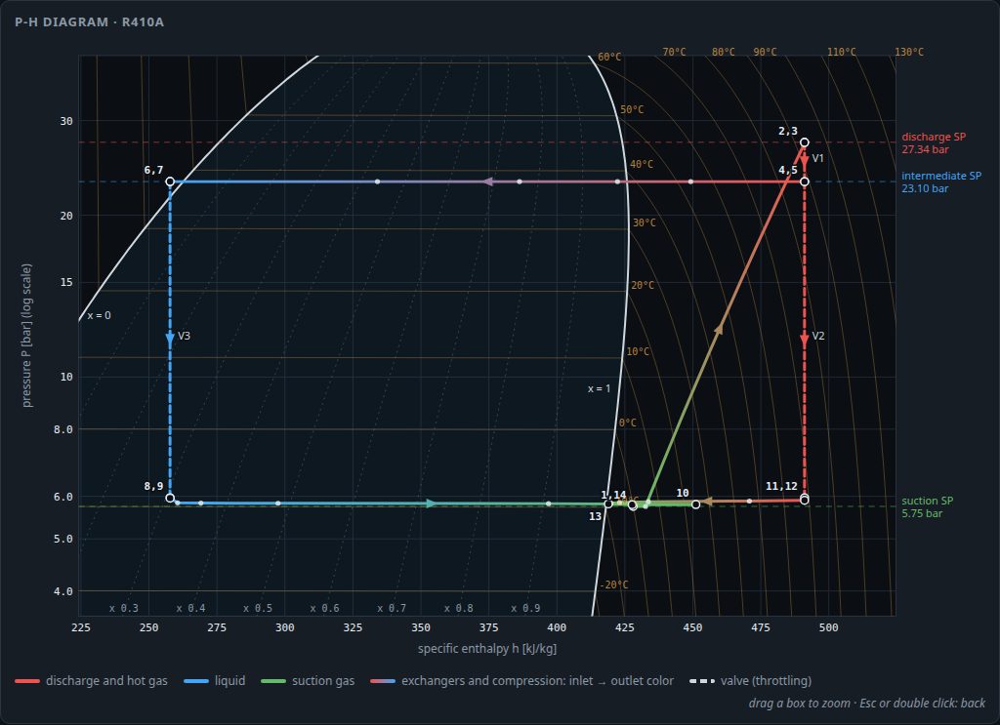
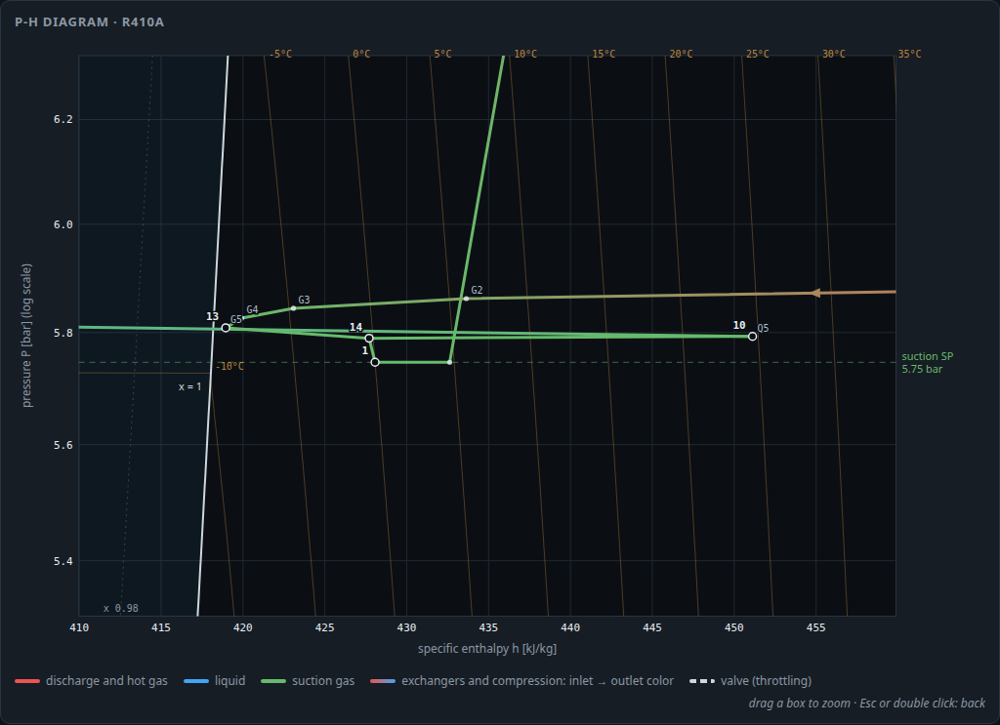

# Web UI: the live stand

A browser interface to run the simulated stand like the real one (`webui/`).

## Running it

```bash
# Docker: builds the frontend and the backend, compiles the model
docker compose -f webui/docker-compose.yml up --build      # open http://localhost:8000

# local development
pip install -e ".[dev]" fastapi "uvicorn[standard]"
uvicorn webui.backend.app:app --reload --port 8000
cd webui/frontend && npm install && npm run dev            # http://localhost:5173
```

The image builds on x86-64 and arm64. For an x86-64 image on Apple Silicon, add
`--platform linux/amd64`.

## Tabs

* **Operator:** live schematic, four PID faceplates (auto / manual, setpoint, manual
  output), the compressor panel (start / stop, permissives, trip reset), process values,
  charging and recovery, a saturation pressure calculator (dew point, x = 1) and the event
  log.
* **Trends:** pressures with setpoints, superheat and subcooling (with the receiver
  liquid's own subcooling), valves, temperatures, mixing exchanger, flow / power / speed and
  inventory (receiver level, condenser flooding and liquid); CSV export.
* **P-h diagram:** the stand's state points on the refrigerant's pressure-enthalpy chart,
  live (see below).
* **Settings:** simulation speed, noise, control interval, ambient and water temperature,
  charging rate, PID tuning and every plant parameter (with units, descriptions and
  defaults). Refrigerant, volumes and charge apply at the next cold or warm start.

A warm start that finds no equilibrium at the chosen point (for example with too little
charge) changes nothing: the stand runs on as it was, and parameters waiting for the next
start stay pending. Should a simulation step ever fail, the stand pauses and the event log
gives the error.

The top bar has the speed factor (up to 100×), pause, cold / warm start and the display
units. The open tab is part of the address (`#operator`, `#trends`, `#ph`, `#settings`), so a
reload or a bookmark returns to it.

The schematic shows both brazed plate exchangers cell by cell. A cell shows its quality while
it is two-phase and its temperature otherwise, and its shading follows the liquid. Every
cell shows the state **leaving** it, at the pressure where it leaves, so the last cell of
each side is that side's outlet:
* the condenser's bottom cell is the condensate draining at S4, subcooled;
* the gas side's top cell is the bypass gas at S2, the "out" temperature beside it;
* the quench side's bottom cell is the quench at S4, after the outlet port.

A note under the schematic's title says so. The P-h diagram plots the same values.

The receiver shows:
* its level and liquid temperature;
* the liquid's subcooling, or "flashing" while it boils off after a pressure drop;
* whether the liquid line has its seal.

The condenser shows its liquid (film and draining condensate) and how much of it is
flooded.

## P-h diagram



The tab draws the stand's state points over the refrigerant's saturated liquid (x = 0) and
saturated vapor (x = 1) lines, with lines of constant quality, isotherms and the setpoint
pressures. Every leg has the color of its pipe on the schematic: red for discharge and hot
gas, blue for liquid, green for suction gas. Through the condenser, the two sides of the
mixing exchanger and the compressor the color blends from the inlet's pipe to the
outlet's. Dashed legs are the valves' throttling, at constant enthalpy.

Numbered points, in flow order:

| # | point | # | point |
|---|---|---|---|
| 1 | compressor suction | 8 | valve 3 outlet |
| 2 | discharge (probe) | 9 | quench inlet S3 |
| 3 | valve 1 inlet | 10 | quench outlet S4 |
| 4 | hot gas header at the valve 2 branch | 11 | valve 2 outlet |
| 5 | condenser inlet S3 | 12 | bypass gas inlet S1 |
| 6 | receiver liquid | 13 | bypass gas outlet S2 |
| 7 | valve 3 inlet | 14 | tee (the two outlets mixed) |

The small dots are the five cells of each exchanger. Points closer together than the
labels allow share one label (for example "2,3": the discharge line's drop is small).

* Values are the model's, without sensor noise or lag. Pressures follow the model's pressure
  chain: line and exchanger drops and static heads.
* Each exchanger cell is the state leaving it, at the pressure where it leaves, as on the
  schematic. The last cell of each side therefore lies on that side's outlet: Q5 on S4
  (point 10), G5 on S2 (point 13), and C5 at the condenser's S4, the drain.
* The tee mixes the gas and quench outlets weighted by the valve 2 and valve 3 flows, which
  is exact at steady state.
* **Compression (1 → 2)** follows the compressor model's stages, as small dots:
  * the motor heats the suction gas at suction pressure;
  * the gas is compressed to the model's adiabatic end state;
  * the shell cools (or heats) it at discharge pressure;
  * the discharge volume brings it to the discharge probe, point 2.

  The model computes only these states. Between them the compression is drawn as a
  polytropic path: a constant small-step efficiency, fitted to end on the model's state,
  the usual way to draw a real compression. The path crosses the isentropes, gaining
  entropy as it goes. The cycle table gives that polytropic efficiency, and the overall
  isentropic efficiency port to port, (h2s − h1) / (h2 − h1), as a stand reports it.
* **Isentropes** (off by default): lines of constant entropy over the vapor and two-phase
  regions, at round values spaced to suit the view. With them on, the isentrope from point
  1 is drawn dashed up to 2s, the end of an ideal compression.
* The condenser leg runs from S3 through its cells to the receiver liquid. The last cell
  is the condensate leaving through the subcooling at the bottom of the plates. The step
  from there to point 6 is the drain line and the pool, which has its own temperature.
* Hovering over a point, or over its row in the table, shows its pressure, temperature,
  enthalpy and its quality, subcooling or superheat.
* **Fit cycle** scales the axes to the points and keeps them while the cycle fits. **Full
  dome** shows the whole dome.
* **Box zoom:** drag a box on the chart to zoom into it, as often as needed. **Back**, Esc
  or a double click returns to the previous view.
  * The saturation lines and isotherms are recomputed for each view, with isotherms at
    round values spaced to suit it (down to 0.5 °C or °F). Quality lines get finer too,
    down to 0.01.
  * Zoomed in, the exchanger cells get labels: C1-C5 for the condenser, Q1-Q5 for the
    quench side, G1-G5 for the gas side, numbered in flow order.
  * The card header shows the pressure and enthalpy under the cursor.

  This helps around the compressor suction, where the gas outlet, the quench outlet, the
  tee and the suction port lie within a few kJ/kg and a few tenths of a bar.



Zoomed to the suction corner at the MT standard point:
* The bypass gas leaves the mixing exchanger (13) just 0.7 K above its dew point, after
  cooling through cells G2 to G5.
* The last quench cell Q5 and the quench outlet (10) are superheated by about 34 K.
* The tee (14) mixes the two.
* The suction line drops the pressure to the compressor port (1) and adds a little heat
  from its wall.
* Inside the compressor, the motor heats the suction gas by about 5 kJ/kg (the small dot
  right of 1) before the compression climbs away.
* **Trail** leaves fading dots behind the main points to show how they moved recently.
  **Hold reference** keeps the present cycle as a dashed outline for comparison, for example
  across a setpoint step.
* The side panel lists every point and cell, the pressure ratio, the enthalpy change over
  each exchanger and the three valve flows.

The property tables end below the critical pressure (at 92 % of it, 85 % for blends). The
dome is closed above that by an estimate, drawn dashed, to the critical point. Across a
blend's glide the isotherms are drawn linear in temperature, as the model treats the
glide. In US units, enthalpy is the tables' value converted to Btu/lb with the tables'
reference state (CoolProp's: for R410A and the single-component refrigerants IIR, 200 kJ/kg
for saturated liquid at 0 °C; blends close to that). It is not the ASHRAE reference used by
many US charts, so compare differences, not absolute values.

## Starting the compressor

The loops run whenever they are in AUTO, compressor on or off, as the stand's controllers
do. At standstill the pressures are far from their setpoints, so the loops drive their
valves to a limit and the start permissives fail (valve 1 needs at least 10 %, valve 2 at
least 5 %). To start:

1. put the four loops in MAN at start positions (for example 50 / 60 / 0 / 30 %);
2. request the run;
3. switch the loops to AUTO once the compressor turns (about 600 rpm).

With the discharge loop in AUTO before that, it closes valve 1 against the starting
compressor and the stand trips on high discharge pressure within seconds. A PV filter on
the discharge loop also slows its answer to the start. With the stand's defaults file
(`FL` = 4 s) the discharge pressure peaks at about 41.6 bar, just over the 41.4 bar trip;
with `FL` = 2 s it peaks at about 39.6 bar. The
anti-short-cycle timers (60 s minimum off, 120 s minimum run) can be switched off on the
Settings tab.

## PID tuning (Yokogawa UT35A)

Each loop is set up like the stand's UT35A controllers (manual IM 05P01D31-01EN, in
`docs/`):

| setting | meaning | range |
|---|---|---|
| `P` | proportional band, % of the input range `RL..RH` | 0.1-999.9 % |
| `I` | integral time | 1-6000 s or OFF |
| `D` | derivative time (on PV) | 1-6000 s or OFF |
| `DR` | `DIR` (output rises with PV) or `RVS` | |
| `OL..OH` | output limits | 0-100 % |
| `FL` | PV input filter: a first-order lag on the PV, ahead of the display and the PID | 1-120 s or OFF |

A setting read off a real controller carries over directly, provided `RL..RH` matches its
input range. Setpoints stay inside the input range. The control interval defaults to
0.2 s, the UT35A's control period. Faceplates show the filtered PV; the schematic, trends
and permissives show the sensor values.

As on the real stand, the third loop controls the suction *temperature* (a warm start
derives its setpoint from the test point's superheat); the training environment's baseline
controller works on superheat.

## Defaults file

All defaults (simulation settings, the four loops and every plant parameter) come from
`webui/config/stand_defaults.json`, which docker compose mounts at `/config`
(`HGBP_DEFAULTS=/config/stand_defaults.json`).

* Edit it on the host and restart: `docker compose -f webui/docker-compose.yml restart`.
* Keys left out keep their built-in value. An unknown key or an out-of-range value stops
  the backend with a message naming it (`docker compose -f webui/docker-compose.yml logs`).
* A missing file is created from the built-in defaults; `python -m hgbp_sim.defaults <path>`
  writes them too.
* Units are listed in the file's `_about` entry: loop setpoints and ranges in bar absolute
  or °C, plant parameters in SI.
* The stand's file sets `FL = 4` with the stand's own tuning. The built-in defaults leave
  `FL` off: their gains were tuned without a filter, and with it their discharge pressure
  loop overshoots to the trip at a cold start.

## Display units

The units selector switches each browser between metric and US units (remembered in the
browser). It applies to operating values, the start dialog, conditions and the CSV export;
the plant parameter table stays in SI.

| quantity | metric | US |
|---|---|---|
| pressure | bar (absolute) | psia |
| pressure drop | kPa | psi |
| temperature | °C | °F |
| superheat, subcooling | K | °F |
| refrigerant flow | g/s | lb/h |
| water flow | kg/min | gpm |
| heat | kW | Btu/h |
| electrical power | kW | kW |
| charge | kg | lb |
| specific enthalpy | kJ/kg | Btu/lb (same reference state) |
| specific entropy | kJ/(kg·K) | Btu/(lb·°F) (same reference state) |

## Backend API

The engine is `hgbp_sim.live.LiveStand` (one stand, four PID loops, the start/stop
interlock, trips, charging, a rolling history), which can also be scripted directly. The
backend (`webui/backend/app.py`) serves it over HTTP in metric units:

| endpoint | purpose |
|---|---|
| `GET /api/state` | current snapshot |
| `POST /api/loop/{name}` | mode, `sp`, `out`, `P`, `I`, `D`, `FL` |
| `POST /api/compressor` | run / stop, speed, trip reset |
| `POST /api/sim` | pause, speed factor, noise, control interval, conditions, charging rate |
| `POST /api/init` | cold or warm start |
| `GET/POST /api/params` | plant parameters |
| `POST /api/charge` | add or recover refrigerant |
| `GET /api/history` | trend history |
| `GET /api/export.csv?units=metric\|english` | history as CSV, columns labelled with units |
| `GET /api/saturation?T=` | dew point pressure of the refrigerant at `T` °C |
| `GET /api/ph_chart?temps=&view=&unit=&n=&s=` | P-h chart background: saturation lines and isotherms at `temps` (comma-separated °C), over the whole dome or over `view` = h0,h1,P0,P1 (kJ/kg, bar) with about `n` isotherms at round values of `unit` (C or F); `s=1` adds about `n` isentropes |
| `WS /ws` | the latest snapshot and new history rows, at most ten messages per second |
